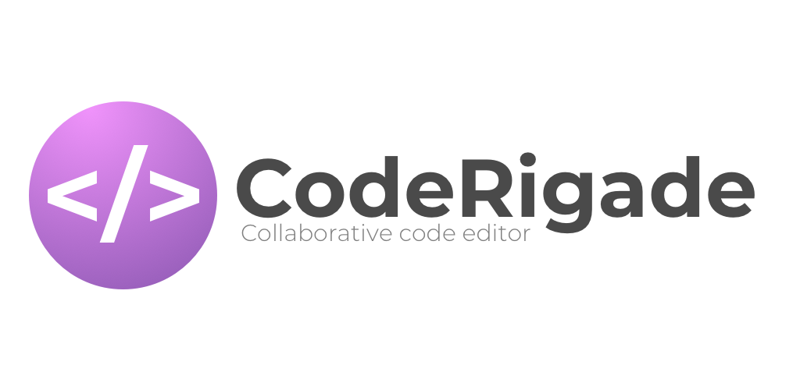
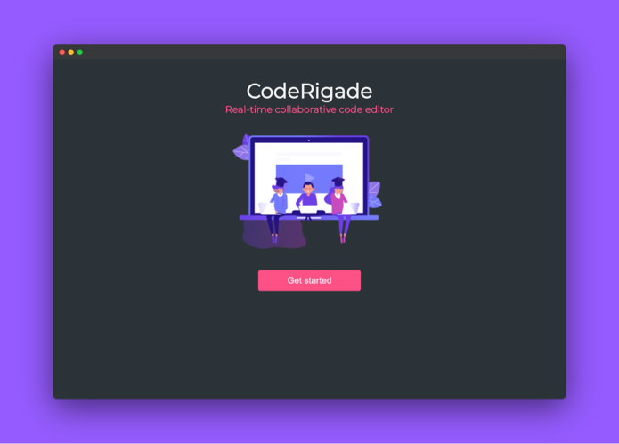
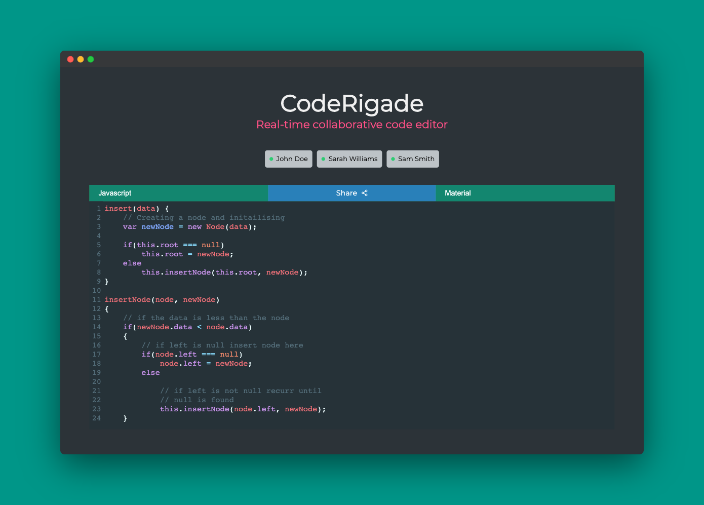
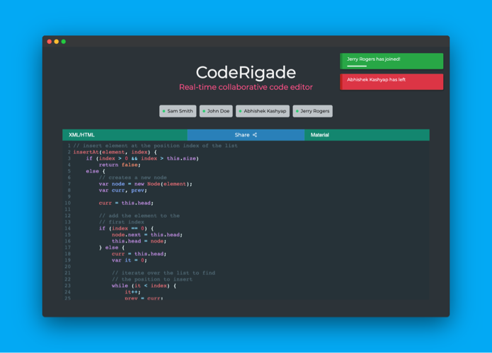

[](https://app.netlify.com/sites/coderigade/deploys)

CodeRigade is a realtime collaborative code editor.

[View live version](https://coderigade.netlify.app/)

## Getting Started

### Setting up frontend

```bash
npm install     #Installing dependencies
npm start       #Starting dev server
```

### Setting up backend

```bash
cd server       #Change directory to server
npm install     #Installing dependencies
npm run dev     #Starting dev server
```

## Screenshots

<p align="center">
  
  
  
</p>

## Built With

- [ReactJS](https://reactjs.org/) - A JavaScript library for building user interfaces
- [CodeMirror](https://codemirror.net/) - CodeMirror is a versatile text editor implemented in JavaScript for the browser.
- [NodeJS](https://nodejs.org/) - Node.js® is a JavaScript runtime built on Chrome's V8 JavaScript engine.
- [Socket.io](https://socket.io/) - Socket.IO enables real-time, bidirectional and event-based communication.

## Contributing

Please read [CONTRIBUTING.md](CONTRIBUTING.md) for details on code of conduct, and the process for submitting pull requests to me.

## Authors

- **Abhishek Kashyap** - _Initial work_ - [abhishekashyap](https://github.com/abhishekashyap)

## License

This project is licensed under the MIT License - see the [LICENSE.md](LICENSE.md) file for details